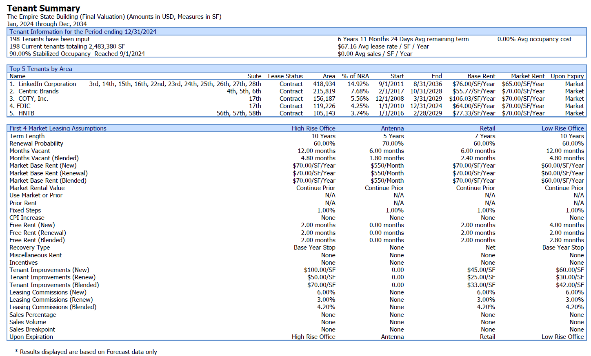
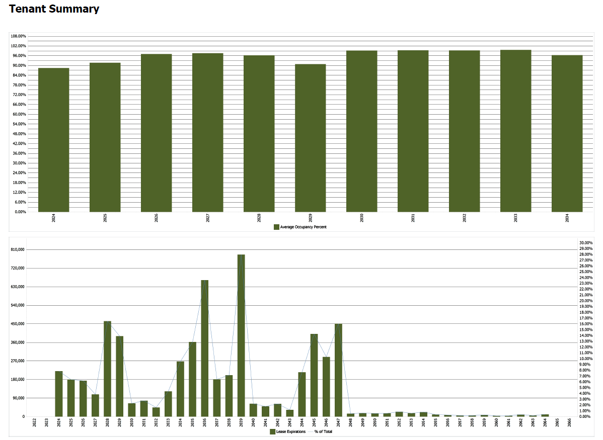
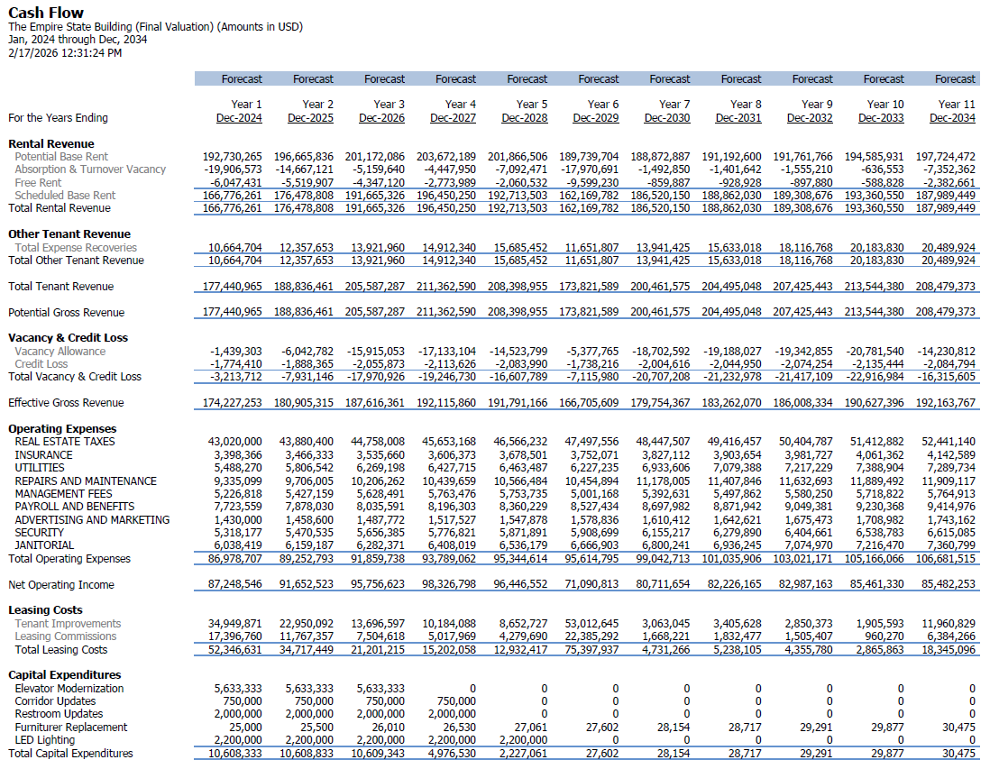
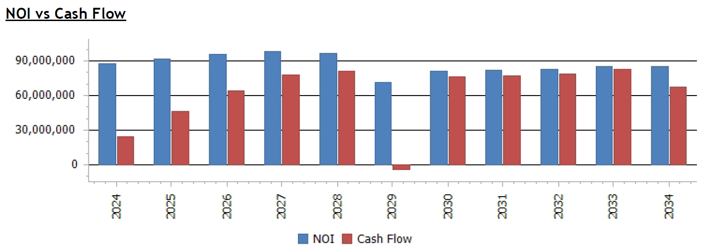
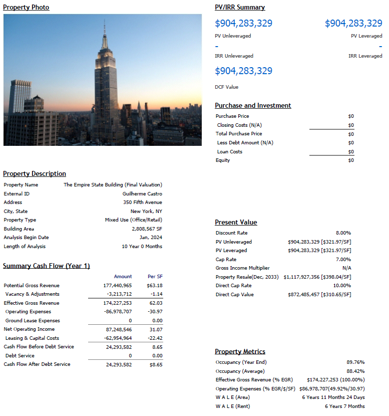
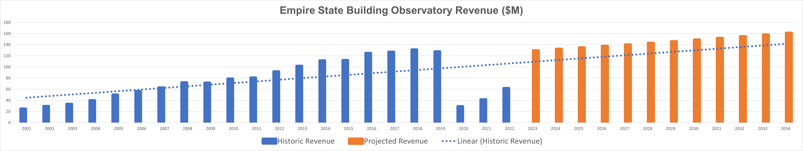
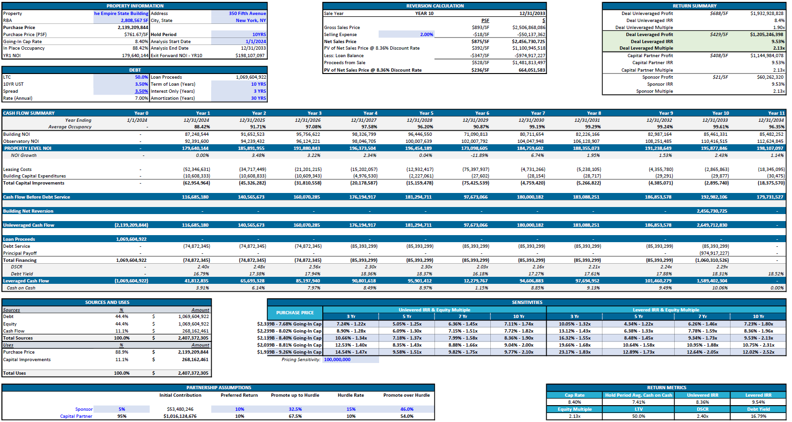

# ESB Case Study — ARGUS Valuation & Excel Investment Consolidation

## 📌 Overview

This case study models the valuation of the Empire State Building investment using a two-stage workflow:

1. **ARGUS Enterprise** used to determine the **purchase price (present value) of the building mixed-use retail/office leasing operations**
2. **Excel financial model** used to **consolidate the full investment**, combining:

   * Building valuation (from ARGUS)
   * Observatory business component
   * Final investment return metrics

---

## 🏢 Project Structure

### 📊 Stage 1 — Building Valuation (ARGUS Enterprise)

ARGUS is used to:

* Model leases and rent roll
* Project operating cash flows
* Apply market leasing assumptions
* Apply financial market assumptions
* Generate stabilized NOI
* Determine **present value / acquisition price of the building**

**ARGUS - Tenant Summary**

**ARGUS - Cash Flow**

**ARGUS - NOI vs Cash Flow**

**ARGUS - Valuation Output**

---

### 📊 Stage 2 — Investment Consolidation (Excel)

The Excel model integrates:

* ARGUS-derived building purchase price, rent roll and cash flow
* Observatory operating income
* Capital structure assumptions
* Return metrics

**Excel — Observatory Financials**

---

## 📈 Financial Modeling Components

### 1. Cash Flow Construction

* Building operational Cash Flow from ARGUS
* Observatory standalone income stream
* Combined property-level cash flow

---

### 2. Valuation & Returns

Excel calculates:

* Cap rate
* IRR
* Hold Period Avg. Cash on Cash
* Equity multiple
* LTV
* DSCR
* Debt Yield

---

### 3. Sensitivity Analysis

Stress tests performed on:

* Cap rate
* Purchase price
* Equity multiple
* IRR

**Excel — Consolidated Pro Forma**

---

## Final Valuation Summary

| Component | Estimated Value |
|---|---|
| Building (Real Estate Operations) | ~$900M |
| Observatory (Operating Business) | ~$1.2B |
| **Total Asset Value** | **~$2.1B** |

## Likely Buyer Profile

The underwriting aligns with a **Core+ investor** strategy:

- Sovereign wealth funds  
- Insurance capital  
- Public REITs  
- Long-term institutional holders

Characteristics:

- Focus on durable income  
- Moderate leverage  
- Long hold horizon  
- Trophy asset positioning  
- Inflation hedge exposure

## Primary Investment Metric

The analysis emphasizes **unleveraged IRR** as the primary performance metric.

Rationale:

- Aligns with Core+ acquisition strategies  
- Reflects intrinsic asset performance  
- Avoids distortion from leverage structuring  
- Supports institutional investment decision-making  

---

## Key Assumptions

### Valuation & Discounting
- Building discount rate: ~8%  
- Observatory discount rate: ~9%  
- Building Exit cap rate: ~7%  
- Observatory Exit cap rate: ~8%

### Operating Assumptions
- Vacancy: ~10%
- Credit Loss: ~1%  
- Rent growth: ~1.5% annually  
- Expense growth: ~2% annually  

---

## Capital Markets Assumptions

Investment structuring reflects institutional financing conditions:

- Expected leverage: ~50% LTV  
- Debt source: insurance / CMBS-style financing
- 10-year Treasury: ~3.5%
- Credit spread: ~350 bps
- Interest rate environment: ~7%  
- Long-term fixed-rate orientation  

---

## 🛠️ Files Included

### ARGUS Enterprise File (.avux)

* Rent Roll
* Market leasing assumptions (MLA)
* Cash flow projections
* NOI stabilization
* Building present value (purchase price)

### Excel Model (.xlsx)

* Observatory financial model
* Building financial model
* Consolidated investment underwriting
* Sensitivity analysis

---

## How to Navigate This Case Study

1. Open the ARGUS file to review building leasing operation valuation.
2. Open the Excel model.
3. Review consolidation of:

   * Building valuation
   * Observatory operations
4. Analyze final investment returns and sensitivities (Property Summary).

## 📎 References

* [CRE Analyst Valuation in Argus](https://www.creanalyst.com/argustraining)

---

✅ This project is intended for educational and portfolio purposes, demonstrating real estate underwriting and valuation proficiency using industry tools.

---

